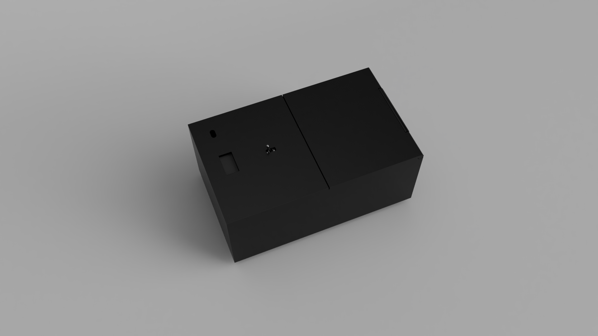
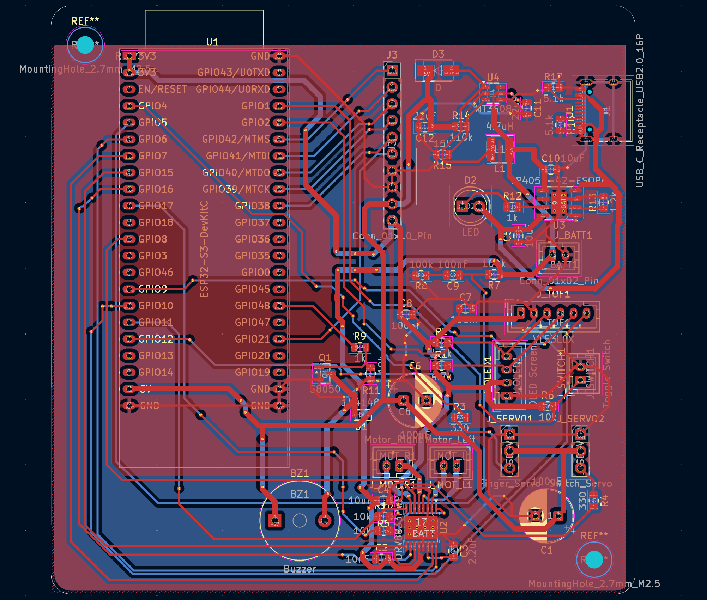
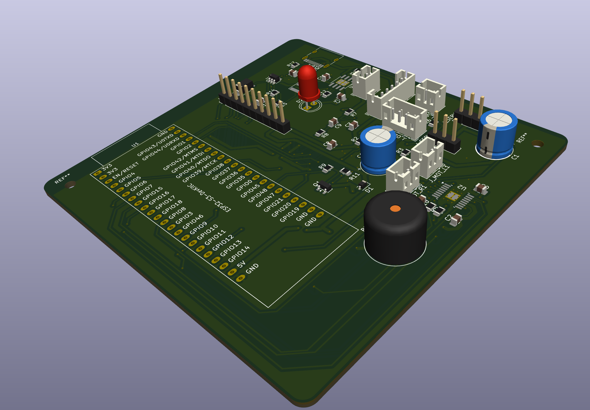
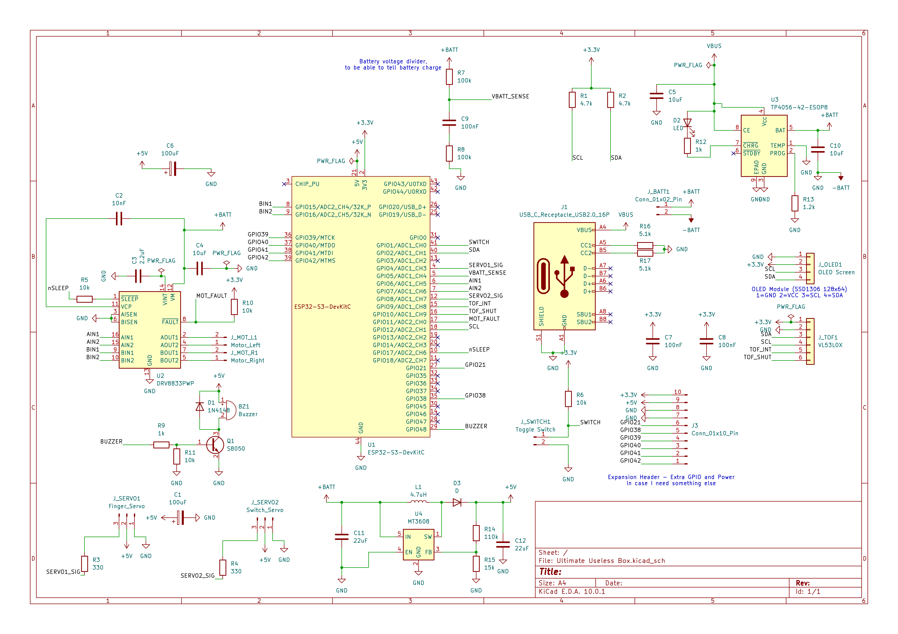
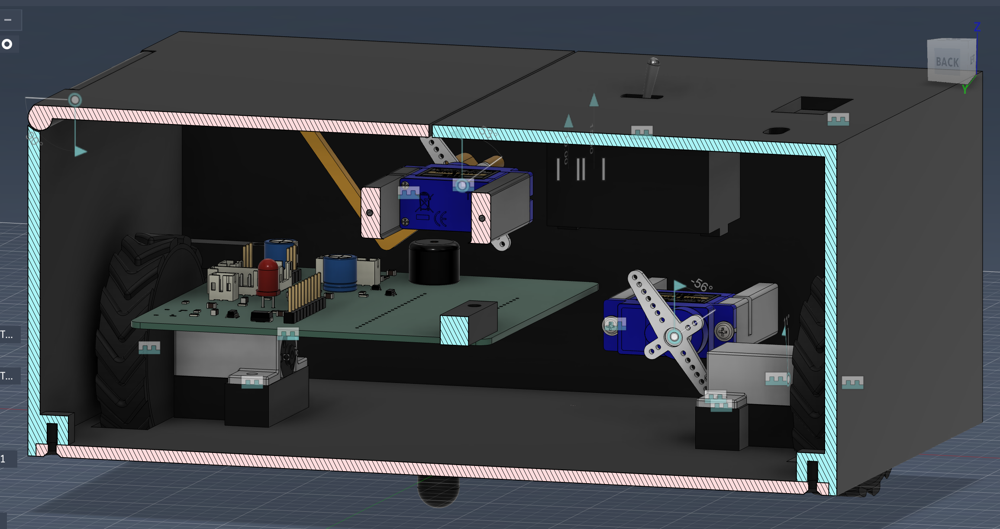
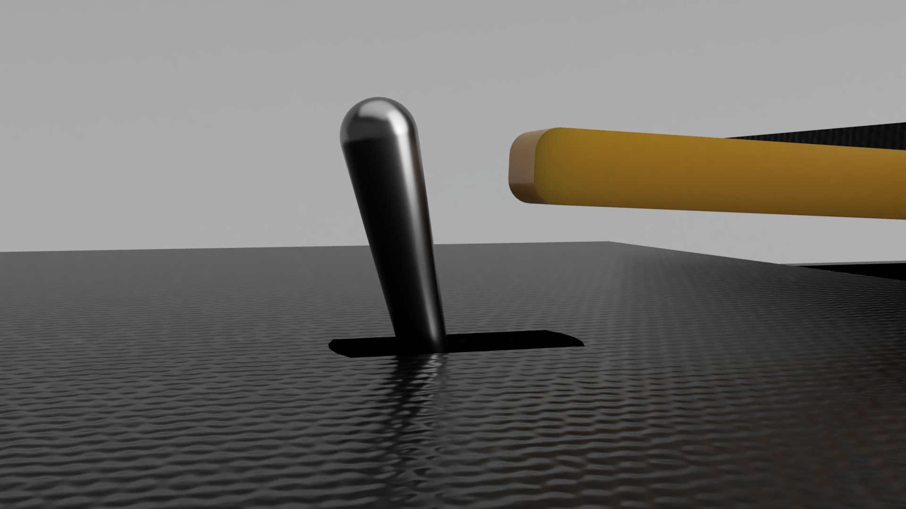
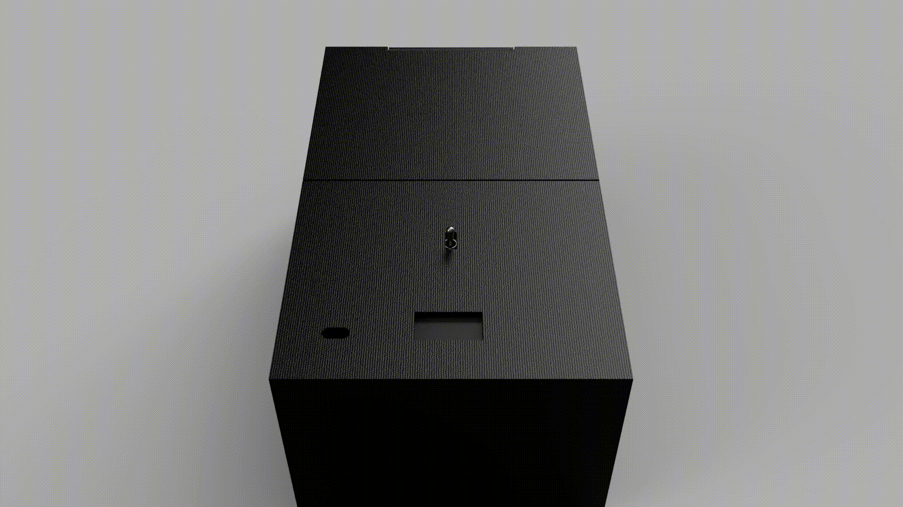
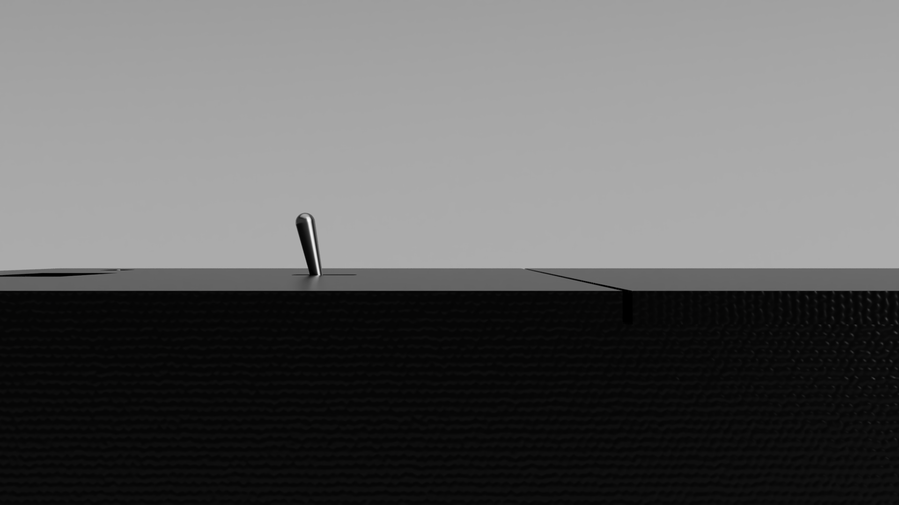
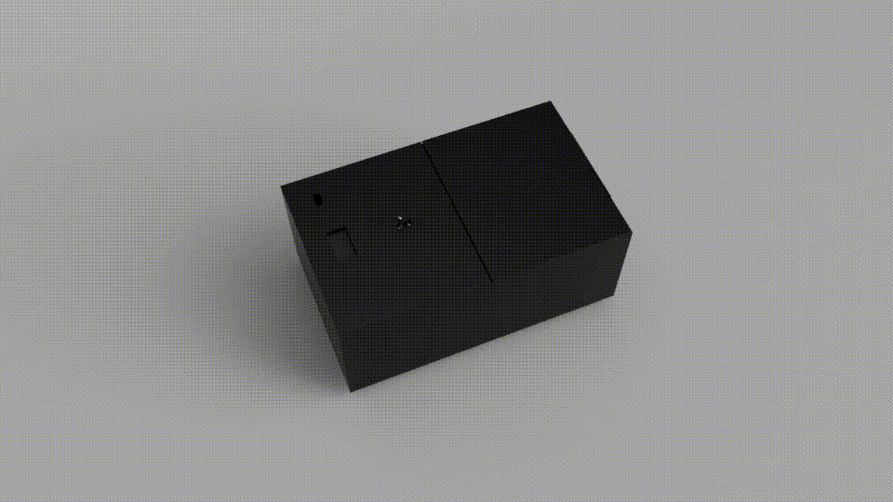

[![Stargazers][stars-shield]][stars-url]
[![Issues][issues-shield]][issues-url]
[![project_license][license-shield]][license-url]

<!-- PROJECT LOGO -->
 

  

<h3 align="center">Ultimate Useless Box</h3>

  

    The Ultimate Useless Box, a box that does nothing, with style.
     
     
    <a href="#gallery--renders">View Renders</a>
    &middot;
    <a href="#custom-pcb">View PCB</a>
  

<!-- TABLE OF CONTENTS -->

  
Table of Contents

  <ol>
    <li>
      <a href="#about-the-project">About The Project</a>
      <ul>
        <li><a href="#built-with">Built With</a></li>
      </ul>
    </li>
    <li>
      <a href="#gallery--renders">Gallery & Renders</a>
    </li>
    <li>
      <a href="#custom-pcb">Custom PCB</a>
    </li>
    <li><a href="#bill-of-materials">Bill of Materials</a></li>
    <li><a href="#license">License</a></li>
  </ol>

<!-- ABOUT THE PROJECT -->
## About The Project

While most useless boxes just flip a switch, this one has personality. Powered by an **ESP32-S3**, this box uses a Time-of-Flight sensor to detect your hand before you even push the swtich, allowing the box to react by driving away, with the OLED screen, or countless other ways!
This project is heavily inspired by LuuMa EV3.
When I saw that video many years ago, I realized I wanted my own useless box. Then I realized that Lego Mindstorm kits are prohibitively expensive. Many years later and I decided to make my own using standard electronic components with a few unique twists of my own :)

**Key Features:**
* **OLED Display** for animated faces.
* **Fun Built in Power Management:** Mainly for learning and fun but we charge over usb-C!
* **Wheels** for driving away.
* **TOF** sensor for detecting hands.
* **A Retractable Switch**

(<a href="#readme-top">back to top</a>)

### Built With

*   
*   
*   
*   

(<a href="#readme-top">back to top</a>)

### Custom PCB

  
  
    

<!-- GALLERY -->
<h2 id="gallery--renders">Gallery & Renders</h2>

  
  
  
  
  

(<a href="#readme-top">back to top</a>)

### Project Goals
- Build a reliable useless box with some personality
- Use accessible parts and open files
- Learn more about PCB design

## How to build
It should be pretty easy, the PCB has labeled connectors for what you need to plug in where. Basically, plug the servos into the headers labeled servos, the motors into the ports labeled motor right and motor left, the TOF sensor into TOF and switch into Switch, and you should be good to go.

(<a href="#readme-top">back to top</a>)

<!-- MARKDOWN LINKS & IMAGES -->
<!-- https://www.markdownguide.org/basic-syntax/#reference-style-links -->
[stars-shield]: https://img.shields.io/github/stars/jaxfry/Ultimate-Useless-Box.svg?style=for-the-badge
[stars-url]: https://github.com/jaxfry/Ultimate-Useless-Box/stargazers
[issues-shield]: https://img.shields.io/github/issues/jaxfry/Ultimate-Useless-Box.svg?style=for-the-badge
[issues-url]: https://github.com/jaxfry/Ultimate-Useless-Box/issues
[license-shield]: https://img.shields.io/github/license/jaxfry/Ultimate-Useless-Box.svg?style=for-the-badge
[license-url]: https://github.com/jaxfry/Ultimate-Useless-Box/blob/main/LICENSE.txt

